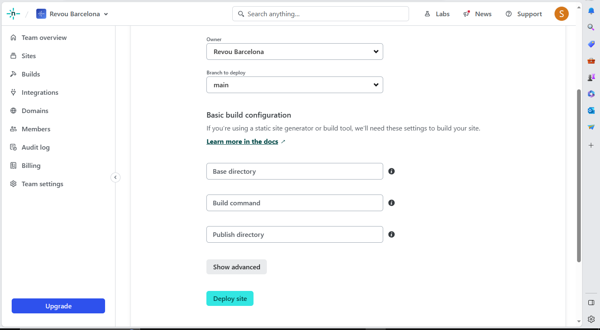
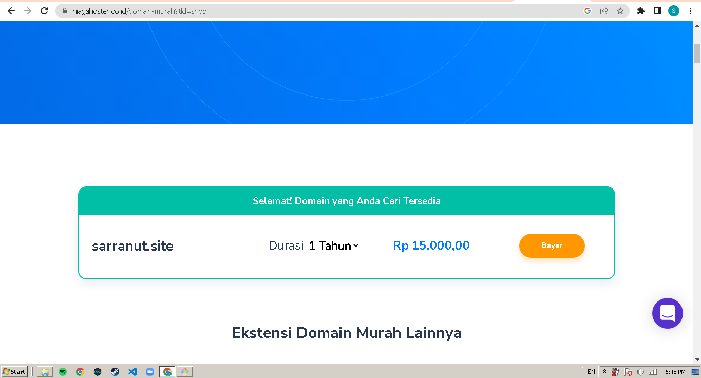
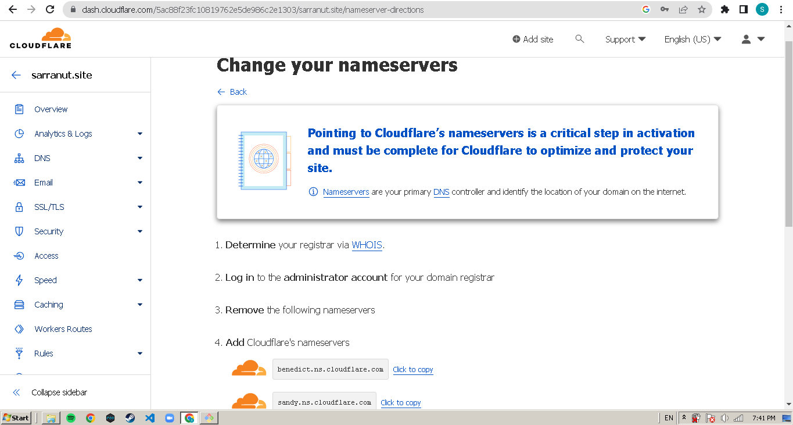
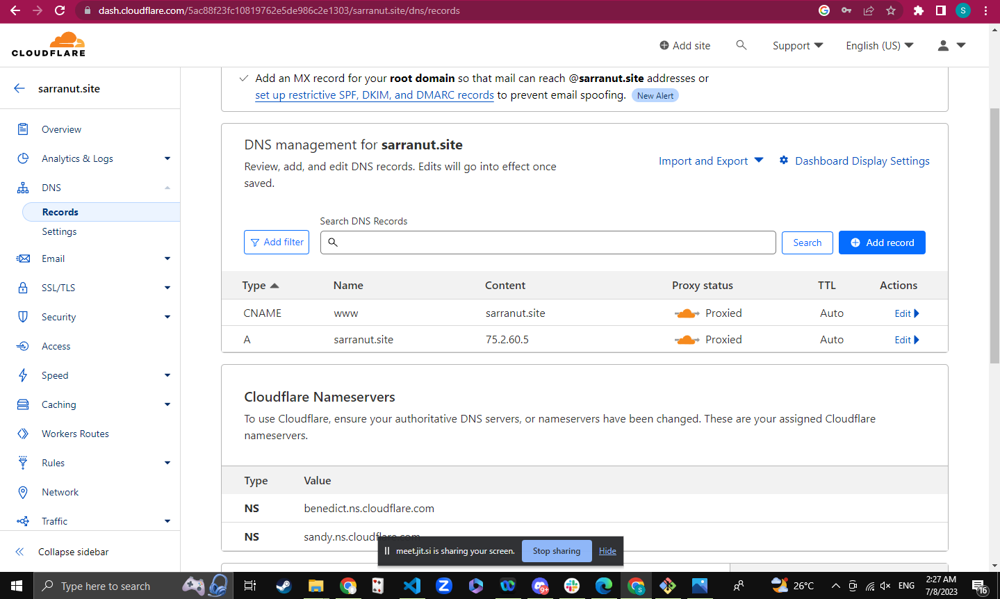
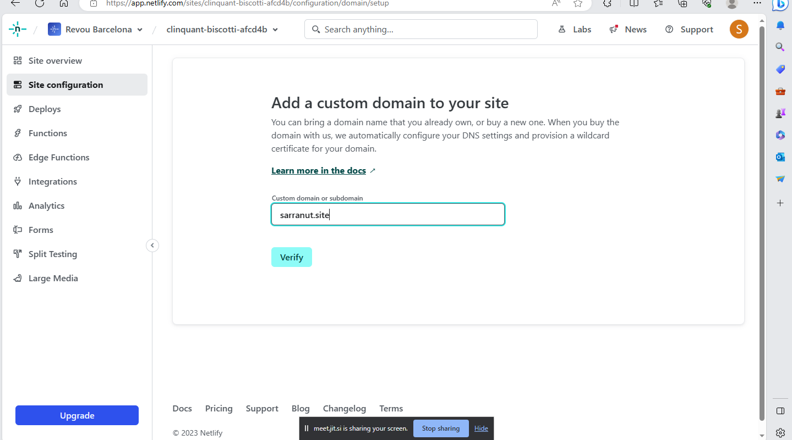
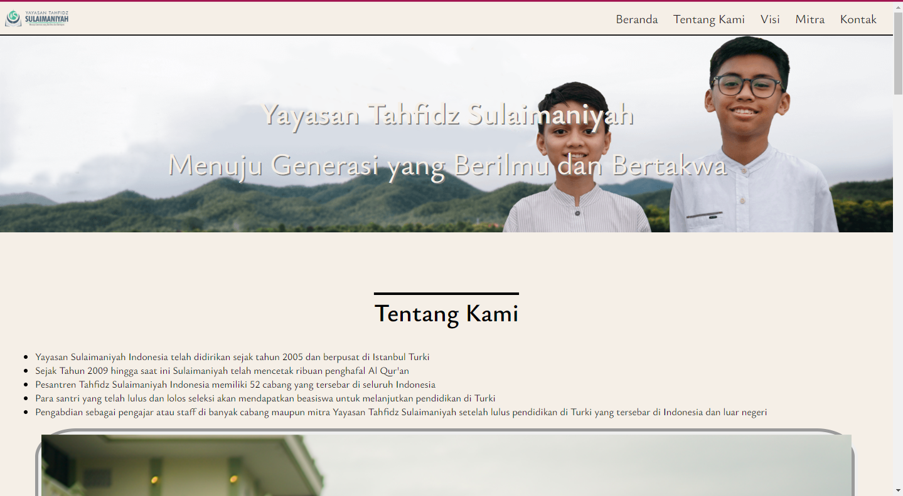

# Documentation
*Theme Name :* Yayasan Tahfidz Sulaimaniyah (Front End Project)

*Author :* Sarra Nutrisia

*Created :* 14/07/2023 

*HTML Version :* HTML 5

*CSS Version :* CSS 3

***
If you have any questions about this theme, feel free to e-mail me at **sarra.nutrisia@gmail.com**
***
## Table of Contents
1. HTML Structure
2. CSS File
3. JavaScript File
4. Readme File
5. Images File

***
## 1. HTML Structure
The HTML Structure for each page is as follows:
* Meta
* Link to CSS Files
* Link to JavaScript File
* Header
	* Home Link
	* About Link
	* Contact Link
* Content
	* Tentang Kami
	* Visi & Misi
	* Mitra Sulaimaniyah
	* Video
	* Form
* Footer
	* Copyright
  
Web Address: https://sarranut.site/
  
***
## 2. CSS File
There are two CSS file in this theme:
* stle.css
* responsive.css

##### indexstyle.css
This CSS file is the main stylesheet for the theme. It holds all the values for the different elements of theme and the default color scheme.

##### responsive.css
This CSS file contain responsive web design provides an optimal experience, easy reading and easy navigation with a minimum of resizing on different devices such as tablet and desktop.

***
## 3. JavaScript File
There is one JavaScript file in this theme:
* index.js

##### index.js
This theme use the alert function of JavaScript.

***
# Deployment Process & Custom Domain
There are few steps in Deployment Flow, Buy A Domain, Setting Up Cloudflare, Setting Up DNS and Connect Domain to Netlify.
***
## Deployment Flow
Before sign up to netlify, make sure you have a github account and had push your project to your Github Account. After that, follow this step :
1. Go to https://www.netlify.com
2. Sign Up to Netlify > Sign Up with GitHub
3. After the configuration with GithHub, then choose Add New Site > Import an Existing Project

4. Connect to git provider > Pick a repository > Choose Site Configuration and Deploy the Site

5. After deploy the site, it will be automatically refreshed when you push "project" to your GitHub.

## Buy A Domain
Please do a research which domain site do you prefer to purchase based on the price and needs.
1. Go to https://www.niagahoster.co.id/ (I choose this because it's cheap and convincing)
2. Login > Register > Choose Service "Domain".
3. Type your domain name you want > and then click "Cari Sekarang", click "Bayar".

4. Follow the instruction for following payment option.
5. The Domain Site has been purchased and you can use it.
   
## Setting Up Cloudflare
Cloudflare is a content delivery network (CDN) and cloud security platform that provides website optimization, security, and performance services. It acts as a mediator between a website's server and its visitors, improving the speed and reliability of the website while also protecting it from online threats.

1. Go to https://dash.cloudflare.com/login > click Sign up.
2. Follow the instruction and confirm your email > Login with your account.
3. Click "Add a website or application" button on the bottom of the web page.
4. Input your site name > click "Add Site".
5. Scroll down and choose "Free" > click "Continue" > click "Confirm".
6. To change the Nameservers of your Domain, first click to copy both of Nameserver (1 & 2) to overwrite your domain Nameserver.
  
7. Go to your domain provider, click "Layanan Anda" > click "Kelola Layanan" > click "Ubah Nameserver".
8. Update your nameservers > Paste the nameserver from Cloudflare > click "Simpan".
 

## Setting Up DNS
The Domain Name System (DNS) turns domain names into IP addresses, which browsers use to load internet pages. Every device connected to the internet has its own IP address, which is used by other devices to locate the device.

1. Go to your Cloudflare account, click your website name > DNS > Records, click "Add Record".

2. Then enter "Type: CNAME, Name: www, Content: your Domain Address (i.e : sarranut.site)"
3. Then enter "Type: A, Name: your Domain Address (i.e : sarranut.site), Content: your Netlify IPv4 Address (i.e 75.2.60.5)"

## Connect Domain to Netlify
Select the domain you want to link to your Netlify site and open the DNS records management portal.
1. Login to your Netlify account > click your deployed website.
2. Go to Site Overview > click Domain Settings.
3. Click "Add A Custom Domain to Your Site" and then type your domain name (i.e : sarranut.site) > click "Verify" > click "Add Domain".

4. Then, your website is already to be used.

***

#### Theme by Sarra Nutrisia
If you have any other questions that aren't covered in the documentation, feel free to e-mail <sarra.nutrisia@gmail.com>.